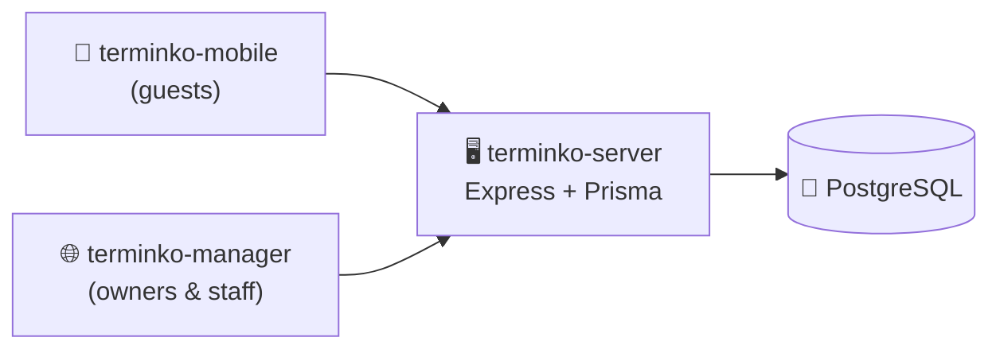

# terminko-server

Backend API for **Terminko**, a multi-tenant appointment scheduling platform
for small businesses (salons, barbers, dentists). Serves a guest-facing mobile
app (booking flow) and an owner/staff web dashboard.

**Live API:** [terminko-server.onrender.com/health](https://terminko-server.onrender.com/health)

> Hosted on Render's free tier. The service sleeps after 15 minutes of
> inactivity, so the first request after a pause takes 30 to 60 seconds while
> the instance wakes up.

> **Part of the Terminko project:**
> - 🖥️ **terminko-server**: REST API (this repo)
> - 🌐 [terminko-manager](https://github.com/xarambash/terminko-manager): Web dashboard (owners & staff)
> - 📱 [terminko-mobile](https://github.com/xarambash/terminko-mobile): Mobile app (guests)

---

## Highlights

- **Multi-tenant by design**. Every resource is scoped to a `Tenant`, and middleware enforces isolation on every request.
- **Role-based access control**. Three roles (Guest, Staff, Owner) enforced through composable Express middleware.
- **Stateless JWT auth**. Token carries `{ userId, tenantId, resourceId, role }` so authorization decisions never hit the database.
- **Available-slots algorithm** offers a start every 30 minutes where the selected service duration fits in working hours and does not overlap a scheduled appointment. Duration overrides are respected.
- **Working hours with multiple intervals per day** (for example 09:00 to 12:00 and 14:00 to 18:00), with overlap validation.
- **Guest booking without registration**. Guests can cancel via a one-time cancellation code, or repeat-book against a persisted `guestId`.

## Tech stack

| Area           | Choice                                     |
| -------------- | ------------------------------------------ |
| Language       | TypeScript 5 (strict, ESM)                 |
| Runtime        | Node.js 20+                                |
| HTTP           | Express 5                                  |
| ORM & DB       | Prisma 6, PostgreSQL                       |
| Auth           | JSON Web Tokens (`jsonwebtoken`), bcrypt   |
| Validation     | Zod                                        |
| File storage   | Supabase Storage (profile pictures)        |
| Email          | Nodemailer                                 |

## Architecture



Three-layer structure: **`routes/` → `controllers/` → `services/`**. Routes
mount handlers, controllers parse and validate, services hold business logic
and Prisma queries. A single Prisma client instance lives in `src/db.ts`.

## Domain model

Ten Prisma models, grouped:

| Group                 | Models                                                        |
| --------------------- | ------------------------------------------------------------- |
| Tenancy               | `Tenant`, `TenantSupportedLanguage`                           |
| Identity              | `User` (owners & staff), `Guest`                              |
| Scheduling primitives | `Resource`, `ResourceWorkingHour`, `ResourceFreeDay`          |
| Catalog               | `Service`, `ResourceService` (join with price & duration)     |
| Bookings              | `Appointment`                                                 |

## Running locally

### Requirements

- Node.js 20+
- npm
- PostgreSQL (a free [Supabase](https://supabase.com/) project works out of the box)

### Setup

```bash
git clone https://github.com/xarambash/terminko-server.git
cd terminko-server
npm install
cp .env.example .env       # fill in the values
npx prisma migrate deploy  # apply schema to your database
npm run dev
```

The API runs on `http://localhost:5000`. Hit `GET /health` for a sanity check.

### Environment variables

| Variable                    | Purpose                                                  |
| --------------------------- | -------------------------------------------------------- |
| `DATABASE_URL`              | PostgreSQL connection string used by Prisma at runtime (pooled) |
| `DIRECT_URL`                | Direct PostgreSQL URL used by Prisma migrations (bypasses pooler) |
| `JWT_SECRET`                | Secret used to sign JWTs                                 |
| `PORT`                      | HTTP port (default `5000`)                               |
| `SUPABASE_URL`              | Supabase project URL (profile-picture storage)           |
| `SUPABASE_SERVICE_ROLE_KEY` | Supabase service-role key (profile-picture storage)      |

### Scripts

| Script          | What it does                                          |
| --------------- | ----------------------------------------------------- |
| `npm run dev`   | Start dev server with auto-reload (`tsx watch`)       |
| `npm run build` | `prisma generate` + `tsc` + copy generated client     |
| `npm run start` | Run the compiled build from `dist/`                   |

## Project structure

```
src/
├── routes/        # Express route mounts (one file per resource)
├── controllers/   # request parsing, validation, response shaping
├── services/      # business logic and Prisma queries
├── middleware/    # auth, tenant scoping, request logging
├── types/         # shared TypeScript types (auth payload, etc.)
├── utils/         # validation helpers, Supabase client
├── db.ts          # single Prisma client instance
└── index.ts       # app assembly and middleware composition
prisma/
├── schema.prisma  # 10 models
└── migrations/    # SQL migrations
```

See [`docs/API.md`](./docs/API.md) for the full endpoint reference.

## What I'd do next

- Automated tests (Vitest), starting with the available-slots algorithm and tenant-isolation middleware
- Rate limiting and request-size limits on public booking endpoints
- OpenAPI spec generated from Zod schemas, with a hosted Swagger UI
- Structured logging (pino) with request IDs
- GitHub Actions CI (lint, type-check, test on every push)

## License

[MIT](./LICENSE) © Stefan Rakonjac

## Author

**Stefan Rakonjac**, [@xarambash](https://github.com/xarambash)
